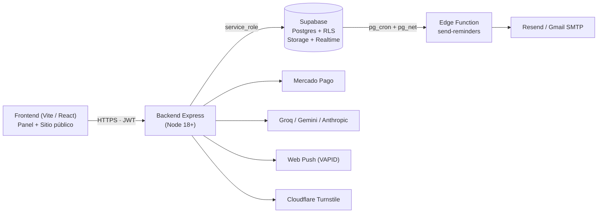

# GESTEK Event OS

> **La primera plataforma de gestión de eventos con IA integrada que los automatiza.**
> SaaS white-label end-to-end: creación, ventas, asistencia, pagos, equipo y un asistente IA propio (Gestbot) que ejecuta acciones reales sobre tu evento.


---

## Características

### Para organizadores
- **Gestbot — asistente IA propio** con más de 50 acciones reales (crear/publicar/editar eventos, armar boletas, check-in, recordatorios, equipo, fidelidad). Acepta lenguaje natural, pide datos con **formularios** y **analiza PDFs e imágenes**. Motor intercambiable con failover automático: **Groq** y **Gemini** (capa gratuita) o **Anthropic Claude**.
- **Eventos completos** con editor visual de bloques y 8 plantillas profesionales.
- **Tickets / boletas** con tipos, cupo, early-bird, zonas; **QR firmado (JWT)** + código corto de respaldo.
- **Asistentes**: importación y exportación CSV, búsqueda, anulación, cortesías.
- **Check-in** con escáner QR o código manual; otorga puntos de fidelidad.
- **Pagos MercadoPago**: boletas directo al organizador + plan Pro a GESTEK. Webhook con HMAC e idempotencia. Modo manual (llave/QR) como respaldo.
- **Equipo y roles** por evento con permisos granulares; chat por canales; tareas tipo Kanban con notificaciones.
- **Sugerencias y solicitudes** del equipo hacia el organizador (módulo bidireccional).
- **Agenda** con vistas Lista / **Día (timeline por horas)** / Semana / Mes; speakers y patrocinadores.
- **Fidelidad**: puntos, recompensas canjeables, ranking del equipo y de clientes.
- **Analítica**: visitas, conversión, ingresos por tipo, fuentes de tráfico, serie diaria.
- **White-label** (todos los planes): logo, colores, fondo, tipografía, radio de bordes, tagline, redes y footer — aplicado en panel y páginas públicas. Sin marca GESTEK en Pro.
- **API REST + Webhooks** firmados con HMAC, **auditoría** de acciones del equipo, lista de espera, códigos de descuento.
- **Recordatorios email** (T-7d / T-1d / T-1h) y push (VAPID).

### Para los miembros del equipo
- **Vista de empleado "Mi trabajo"**: tus eventos, tus tareas pendientes, envío de sugerencias y mensajes al organizador.
- Permisos por rol aplicados **end-to-end** (en la UI y en los endpoints de escritura).

### Para los asistentes
- Página pública del evento con bloques editables y branding del organizador.
- Boleta con QR + código corto; portal `mi-ticket/<código>` para revalidar.
- Lista de espera y notificación push cuando hay cupo.

### Modelo comercial
- **Free** — eventos y asistentes ilimitados, QR, agenda, equipo, fidelidad, página pública.
- **Pro — US$ 19.99/mes — con 14 días de prueba sin tarjeta**. Suma Gestbot, API + Webhooks, auditoría, white-label sin marca y soporte.

---

## Stack

| Capa | Tecnologías |
| --- | --- |
| Frontend | Vite + React 18, TailwindCSS, React Router v6, html5-qrcode, qrcode.react, dnd-kit, code-splitting con `React.lazy` |
| Backend | Node.js (Express 5), autenticación con Supabase JWT, helmet + CORS + rate-limit + sanitización |
| Base de datos | PostgreSQL (Supabase) con migraciones SQL versionadas, RLS donde aplica, `pg_cron + pg_net` para recordatorios |
| Storage | Supabase Storage (avatars, event-media) con políticas y hardening |
| Realtime | Supabase Realtime (postgres_changes) para notificaciones in-app y chat |
| IA | Anthropic SDK + adaptadores REST a Groq y Gemini, con failover y esquema de tools "delgado" |
| Pagos | Mercado Pago Checkout Pro (boletas y plan Pro), webhook HMAC, idempotencia |
| Email | Gmail SMTP o Resend (provider-agnóstico) |
| Push | Web Push + VAPID + Service Worker |
| Anti-bot | Cloudflare Turnstile (graceful sin keys) |
| Edge | Supabase Edge Function `send-reminders` con `pg_cron` horario |

---

## Arquitectura



**Decisiones clave**
- **Multi-proveedor de IA** con failover automático: Gestbot funciona gratis (Groq/Gemini) y sigue operativo si uno se rate-limita.
- **Esquema de herramientas "delgado"** enviado a los modelos: cabe en capas gratuitas con 60+ tools.
- **Auth por ruta** (no `router.use` global) en routers públicos para no interceptar tráfico anónimo.
- **`lib/acceso.js`** centraliza `assertPermiso(eventoId, userId, perms[])`; lo usan todos los endpoints de escritura.
- **Webhook MP idempotente** por `payment_id`, con fallback de tokens (plataforma → owner → todos los conectados).

---

## Empezar

### Requisitos
- Node.js 18+ (probado con 22)
- Cuenta de Supabase con proyecto creado
- *(Opcional)* Cuenta de Mercado Pago, claves VAPID, API keys de Groq/Gemini

### Instalación
```bash
git clone https://github.com/Sekkon0906/GestorEventosMarcaBlanca.git
cd GestorEventosMarcaBlanca
npm run install:all
```

### Configuración
1. Copia `.env.example` a `.env` y completa lo que vayas a usar.
2. En Supabase → SQL Editor: pega `db/migrations/_all_pendientes.sql` (combina 0020 → 0028).

Mínimas:
```env
SUPABASE_URL=...
SUPABASE_SERVICE_KEY=...
QR_JWT_SECRET=cambia-esto
FRONTEND_URL=http://localhost:5173
```

Opcionales clave:
```env
GROQ_API_KEY=gsk_...                  # Gestbot gratis (recomendado)
GEMINI_API_KEY=AIza...                # Gestbot gratis (respaldo)
ANTHROPIC_API_KEY=                    # opcional, mejor precisión
MP_PLATFORM_ACCESS_TOKEN=APP_USR-...  # cobrar plan Pro
MP_WEBHOOK_SECRET=...                 # verificación HMAC
VAPID_PUBLIC_KEY=
VAPID_PRIVATE_KEY=
GMAIL_USER=
GMAIL_APP_PASSWORD=                   # o RESEND_API_KEY=
ALLOW_DEV_PRO_ACTIVATION=true         # solo dev
```

### Correr en dev
```bash
npm run dev:full         # backend (3000) + frontend (5173) juntos
# o por separado:
npm run dev              # backend
npm run dev:frontend     # frontend
```

### Tests
```bash
npm test                 # node:test, sin dependencias
```

### Producción (resumen)
- Backend: cualquier host Node con HTTPS público (Render, Railway, Fly, EC2…).
- Frontend: `cd frontend && npm run build` → servir el `dist/` como estático.
- Recordatorios: ver `docs/RECORDATORIOS.md` + `scripts/deploy-reminders.ps1`.
- Mercado Pago: ver `docs/MERCADOPAGO.md` (runbook completo).

---

## Estructura del repo

```
.
├── index.js                 # Entrada del backend
├── routes/                  # Routers por dominio (eventos, tickets, pagos, agente…)
├── lib/                     # Helpers (acceso, qr, email, agente IA, webhooks…)
├── middleware/              # Auth Supabase
├── config/                  # Seguridad (helmet, CORS, rate limit), env
├── db/migrations/           # SQL versionado (0000…0028) + combinado
├── supabase/functions/      # Edge Functions (send-reminders)
├── docs/                    # Runbooks (MercadoPago, Recordatorios, Seguridad)
├── scripts/                 # Despliegues / utilidades
├── test/                    # Tests con node:test
└── frontend/
    └── src/
        ├── pages/           # Páginas (públicas, panel, agente, equipo…)
        ├── components/      # UI compartida (Confirm, ui/, agente/, layout/)
        ├── context/         # Auth, Toast
        ├── hooks/           # usePlan, useBranding, usePush
        ├── api/             # Clientes REST por dominio
        └── lib/             # i18n, supabase client
```

---

## Documentación

- `docs/MERCADOPAGO.md` — Runbook completo de producción (env vars, webhook, troubleshooting).
- `docs/RECORDATORIOS.md` — Edge Function y cron horario.
- `docs/SEGURIDAD.md` — Endurecimiento (CSP, rate-limit, captcha, JWT rotation).
- `docs/PROYECTO.md` — Presentación completa (arquitectura, decisiones, roadmap).

---

## Contribuir

Proyecto desarrollado por Juan Medina Orjuela. Para sugerencias, abre un Issue o un PR contra `main`.

---

## Licencia

Privado / propietario. Todos los derechos reservados.
